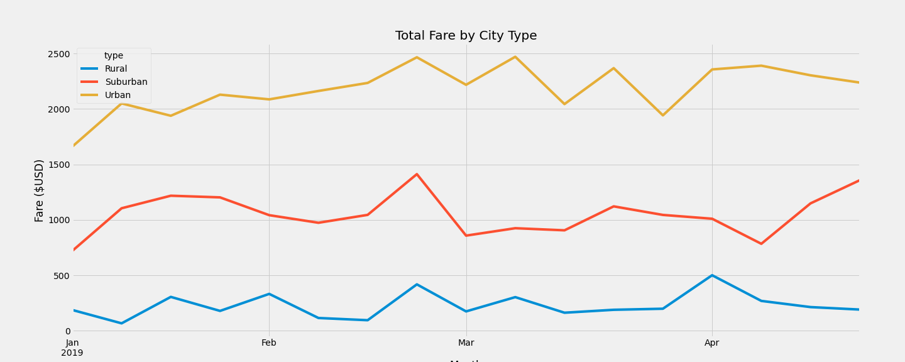
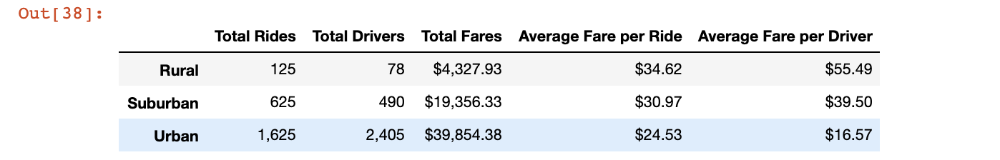

# pyber-analysis
written using jupyter notebook and matplotlib

# Overview and Purpose
We were assigned to create a data frame for ride share data by city type.  This challenge utilized Pandas as well as matplotlib in order to create a visualization for the data collected between different city types.  We then created a multiple line chart in order to showcase the trends in the total weekly fares between the different city types; Urban, Suburban and Rural.

# Data Visualization:

1) Total weekly fare by city line chart

2) Challenge Summary Data Frame:

